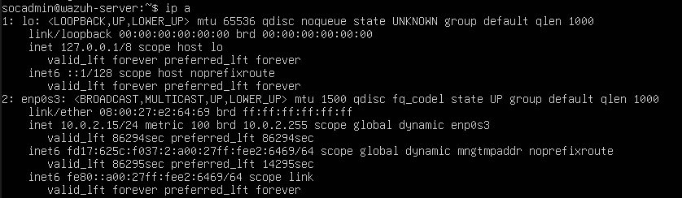
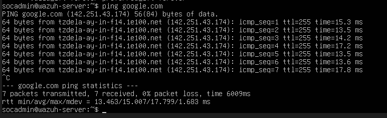

# Phase 1 - Wazuh SOC Server Setup 

Objective:- Set up a dedicated Ubuntu server to act as the central SIEM [Security Information and Event Management] that will act as a Wazuh manager for a SOC lab.

** Enviornment Details 

- Host Machine RAM: 18 GB
- Virtualization: Oracle VirtualBox
- Guest OS: Ubuntu Server 24.04 LTS
- Server Role: SIEM / SOC Manager

** Virtual Machine Configuration

- VM Name: SOC-Wazuh-Server
- CPU: 2 cores
- RAM: 6 GB
- Virtual Storage: 20 GB (LVM enabled)
- Network Mode: NAT

** Installation Steps

1. Created a new Ubuntu Server VM in VirtualBox.
2. Attached Ubuntu Server ISO.
3. Configured disk using LVM with ext4 filesystem.
4. Installed OpenSSH Server for remote management.
5. Skipped optional server steps.
6. Completed installation and rebooted successfully.

** User & Host Configuration

- Hostname: wazuh-server
- Username: socadmin
- SSH Access: Enabled

## Network Verfication :

- ip a 
- ping google.com

Result:

* Network interface recieved IP via DHCP.
* Internet conectivity confirmed.

## Network Verification Screenshots

### IP Address Assignment

### Internet Connectivity Test

## Result & Verification

- Ubuntu Server 22.04 LTS was successfully installed on Oracle VirtualBox.
- Virtual machine resources (CPU, RAM, Storage) were configured correctly and optimized for SIEM deployment.
- Network interface received an IP address via DHCP.
- Internet connectivity was verified successfully from the server.
- OpenSSH Server was installed and enabled for remote administration.
- System reboot completed without errors.
- Base server environment is stable and ready for SIEM installation.
