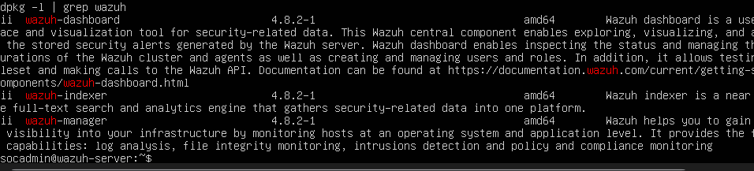
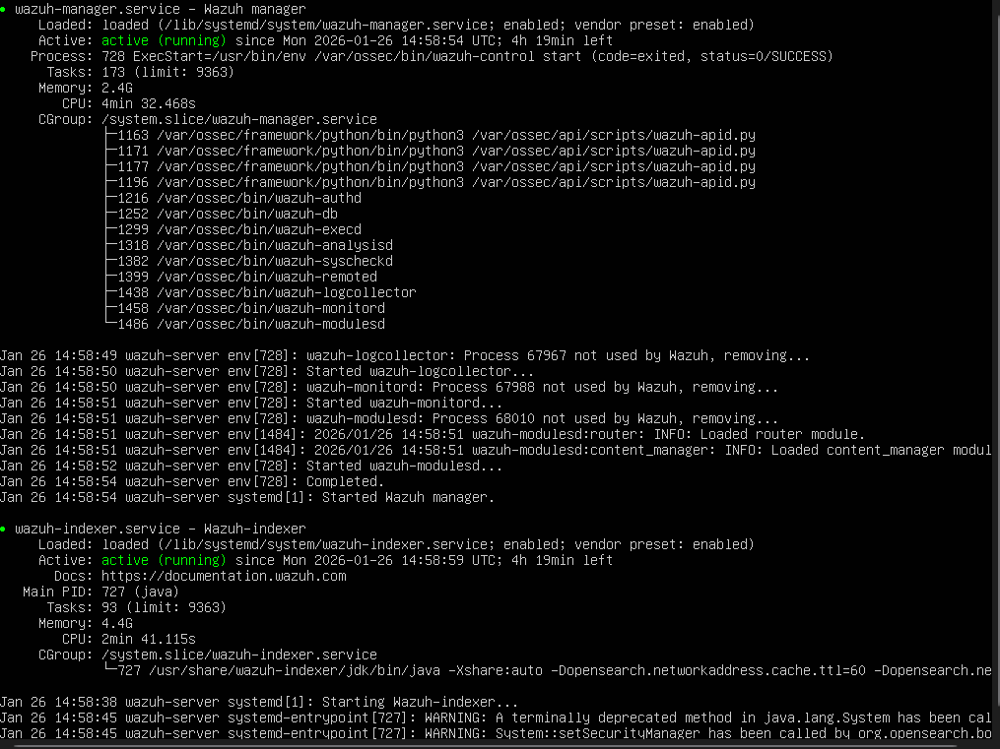
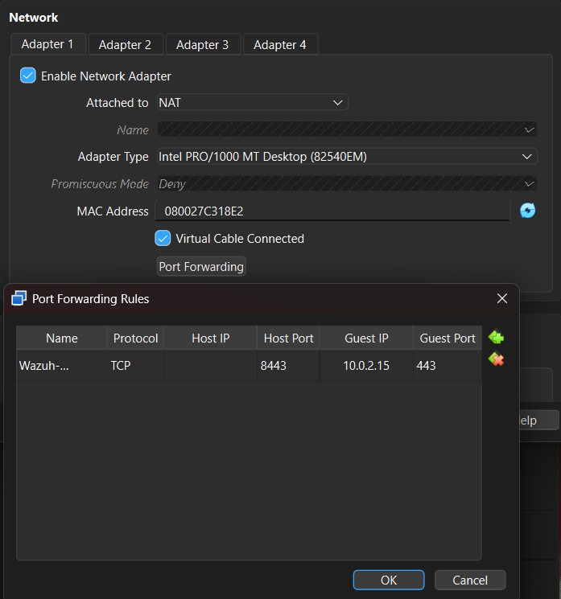
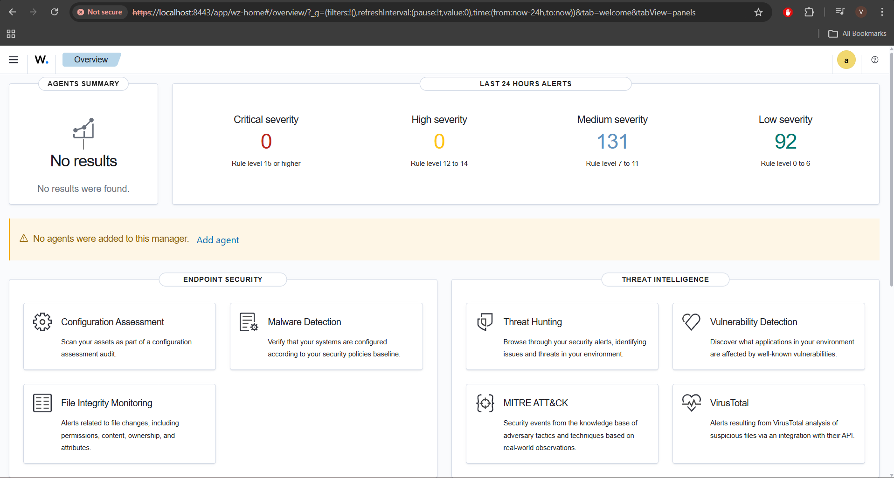

# Phase 2 – Wazuh SIEM Installation & Dashboard Access

## Objective
Deploy a full Wazuh SIEM stack (Manager, Indexer, Dashboard) on Ubuntu Server 22.04 LTS and verify successful access to the Wazuh Dashboard from the host system.

## Environment Details
- OS: Ubuntu Server 22.04.5 LTS
- VM Platform: Oracle VirtualBox
- CPU: 4 vCPUs
- RAM: 8 GB
- Storage: 50 GB (LVM enabled)
- Network Mode: NAT with Port Forwarding
- Wazuh Version: 4.8.2

## Installation Method
The Wazuh SIEM stack was installed using the official Wazuh installation assistant script, which deploys:
- Wazuh Manager
- Wazuh Indexer (OpenSearch)
- Wazuh Dashboard

## Installation Steps

1. System Preparation

apt update && apt upgrade -y
apt install -y curl apt-transport-https lsb-release gnupg

2. Wazuh Installation:

curl -sO https://packages.wazuh.com/4.8/wazuh-install.sh
bash wazuh-install.sh -a

The installation completed successfully and all Wazuh components are deployed.

3. Service Verification:

systemctl status wazuh-manager
systemctl status wazuh-indexer
systemctl status wazuh-dashboard

All services were confirmed to be running.

4. Network Configuration:

Since the VM uses NAT networking, port forwarding was configured in VirtualBox to allow access to the Wazuh Dashboard.

Host Port: 8443

Guest Port: 443

5. Dashboard Access

The Wazuh Dashboard was accessed from the host machine using:

https://192.168.1.47/

Login was successful using the admin credentials generated during installation.

## Result & Verification

- Wazuh Manager, Indexer, and Dashboard installed successfully.
- All Wazuh services are running and healthy.
- Wazuh Dashboard accessible from host machine via HTTPS.
- Secure authentication verified using admin credentials.
- System is ready for agent onboarding and attack simulation in Phase 3.

---

## Installation Completed

## Service Status Verification

## VirtualBox Port Forwarding

## Wazuh Dashboard Home
