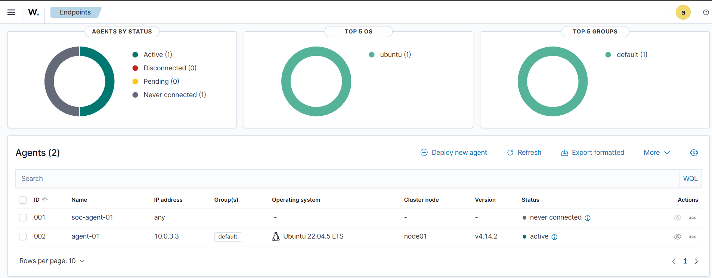

## Phase 3 – Wazuh Agent Deployment & SOC Integration

Objective: The objective of Phase 3 was to deploy a Wazuh agent on an endpoint machine and successfully connect it with the Wazuh Manager to enable real-time monitoring, log collection, and security event detection as part of a SOC (Security Operations Center) environment.

# Architecture Overview:

The SOC lab environment consists of the following virtual machines:

* Wazuh Server (Manager + Indexer + Dashboard)

Operating System: Ubuntu
Role: Centralized log management, detection engine, and dashboard visualization

* SOC-Agent-01 (Endpoint Agent)

Operating System: Ubuntu
Role: Endpoint monitored by Wazuh agent

* Kali Linux (Attacker Machine)

Operating System: Kali Linux
Role: Used for launching simulated cyber attacks in later phases

(All virtual machines are connected using Bridged Adapter networking, enabling direct network communication between the attacker, the Wazuh server, and the monitored endpoint.)

# Implementation Steps:

1.Installed the Wazuh agent on the endpoint machine (SOC-Agent-01).
2.Configured the agent to communicate with the Wazuh Manager using the server IP address.
3.Enrolled the agent with the Wazuh Manager using the authentication service:

"sudo /var/ossec/bin/agent-auth -m <WAZUH_SERVER_IP> -A soc-agent-01"

4.Enabled and started the Wazuh agent service:

"sudo systemctl enable wazuh-agent"
"sudo systemctl start wazuh-agent"

Verified the agent status from the Wazuh Dashboard under Agents Management.

### Screenshots – Agent Active in Wazuh Dashboard

# Results:

After successful enrollment and service startup:

The SOC agent was visible in the Wazuh Dashboard.

The agent status changed from "Never connected" to "Active".

This confirmed that the endpoint was successfully sending logs and security events to the Wazuh Manager.